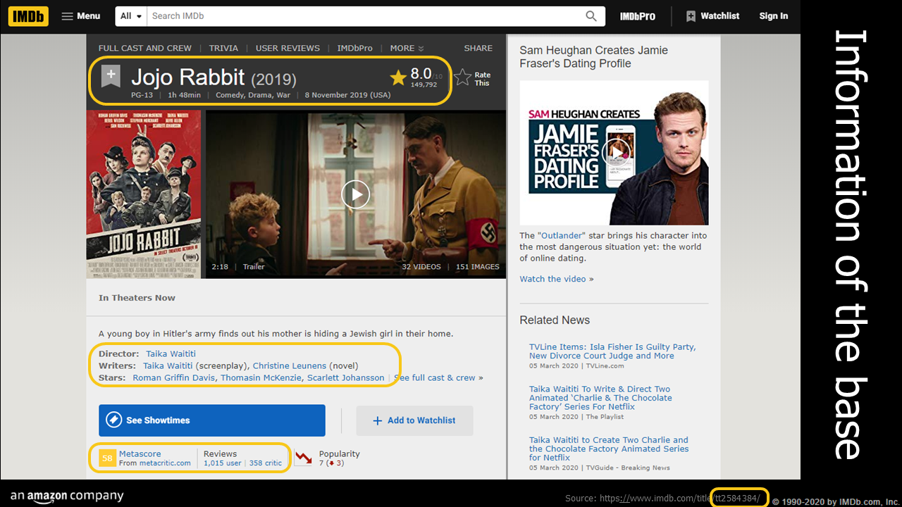
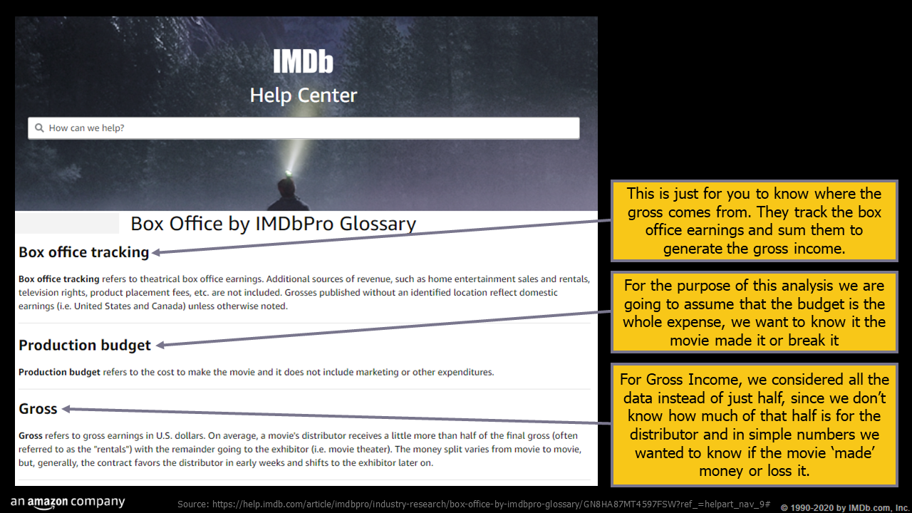
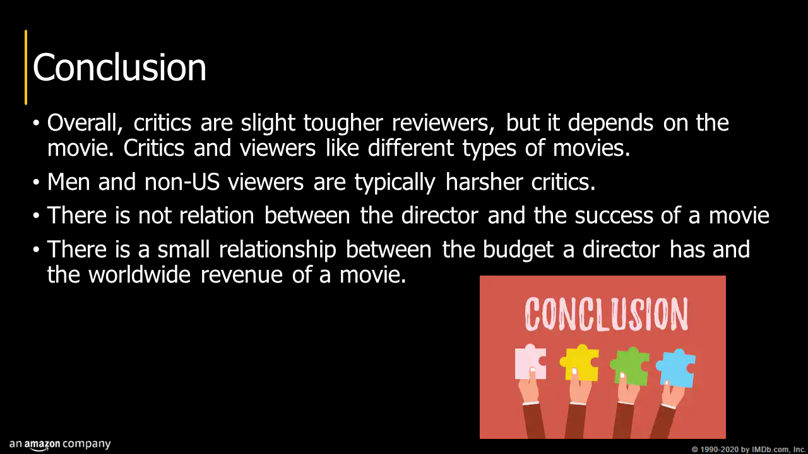

# IMBD-movie-data

It all started pretty inocuous, talking about our likes and dislikes, but when we started talking about movies, everything went from 0 to 200mph in 3 seconds. How do you decide what to watch? Is there that much of a difference between the critics reviews and the people? Which one is more harsh? Is there a relationship between the budget a director has and it's success? Also, what can be considered success? Is it the money or the apraise? Those are some of the questions we are trying to answer with this project.

## Data

The data was retrived from Kaggle and updated by Stefano Leone. You can find the original [here](https://www.kaggle.com/stefanoleone992/imdb-extensive-dataset). This Dataset was scraped from IMDb, the most popular movie website on the internet. This site combines movie plot description, Metasore ratings, critic and user ratings and reviews, release dates, list of actors, general information about them, and many other aspects.

It contains 4 csv files, dividing the data into 4 aspects:

* Movies: contains 81,273 movies with 22 attributes. Some of them are ilustrated below

* Names (cast members): contains 175,719 cast members with 20 attributes
* Ratings: contains 81,273 movies with 49 attributes
* Title Principals (cast members roles): contains 377,848 cast members roles in movies with 6 attributes

Since our interests relied on the ratings and the movies, we only ended up using those two csv files.

## Process

We decided to divide the project into two sections:

1. One dedicated to the reviews of the movies to analyze who, between the critic and the viewer, is harsher when they rate the movies.
2. The second, to review the success of a movie in terms of revenue per director and the user ratings vs the budget.

> Some considerations. We decided to analize all the information in the same currency, and as a result of that, we only analized the information in USD. Also, we define some concepts to help us understand how the data behaved.

### Cleaning

#### Critic Scores vs. Viewer Ratings (information extracted from [this repository](https://github.com/patelpurvip/IMDB_ratings_analysis))

For this process, we decided to delete movies without reviews from both critics and viewers. This end up shortening the data from 81,273 movies to only 12,662.

#### Director's Budget vs their Success

For this section, we started anew with all the information from the data set, from it we deleted empty values from the columns we deemed relevant for this section. After we needed to select only the budget and gross income data that contained values in dollars and take out `$` symbols from those columns. We created two columns called revenue, one with national information and another with worldwide results. To centralize the information, we took out both upper and lower outliers from the budget ending up with only 5,400 movies by 2,542 directors from 1931 to 2019. With a budget range from .2k to 88,000k dollars.

## Results

The final presentation with all our findings can be found in the [Results folder](/Results/imdb.pdf).

#### Copyrights

We don't own the images inside the presentation, we used them only to add some visual representation of the information presented but we are not the owners of those images.
